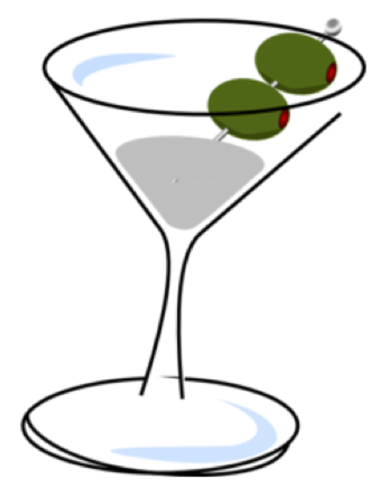

Third project in Metis Data Science bootcamp. Involves analyzing data in terms of classification.

# _To Cocktail or Not To_

## Description

The project is to build a model that predicts whether a food (food ingredient) occurs in a cocktail recipe. The model is intended more for characterization (interpretation), as a discovery device, rather than for any practical advantage of being able to make the prediction.

## Features and Target Variables
The **_target_** label, therefore, is determined by matching one data source for food (food items) with existing sources for cocktail recipes, and using that match to assign a true vs. false label for the particular food (food item).

**Features** include
Categories
* food group
* food subgroup
* food type (unprocessed vs. processed)
* 15,000 types of continuous measurements which are the concentrations (in mg per 100 grams) of chemical compounds in each food part (leaf, bulb, fruit, seed).

## Data Used
Data sources were primarily   
* **Food**:
  - _FoodDB.ca_ https://foodb.ca/ (1 GB db of food compounds and properties etc). The largest table in the dataset contains 5 million rows listing the 15,000 types of continuous measurements mentioned above.
* **Cocktail Recipes**:
  - _CocktailDB_ www.thecocktaildb.com/api
  supplemented by
  -  _PubClub_ www.pubclub.com/lifestyle/8-exotic-cocktails-from-around-the-world-that-you-must-try-at-your-next-party/

## Tools Used
scikitlearn  
pandas  
numpy  
matplotlib  
nltk  
beautiful soup  
pickle

## Analysis and results
Since classes (_in_ vs. _not in_ a cocktail) were so imbalanced (a 1:7 ratio), _log loss cross-entropy_ and _ROC-AUC_ (rather than accuracy) were used as metrics. This also recommended itself because, although _recall_ was an important consideration, no particular threshold was appropriate to the purpose of the study, such at neither _precision_, _recall_, _F1_, nor even _FBeta_ could be considered completely appropriate as metrics. While seeking to minimize log-loss cross-entropy and ROC-AUC scores, validation was performed by comparing the train-vs.-test _difference_ of log-loss cross-entropy scores on multiple trials of train and validation.

Among the results, ultimately based primarily on _Logistic Regression_ models and _Extreme Gradient Boosted_ (XGB) models, is that foods are predicted to be in a cocktail recipe particularly to the extent they fall into the categories of: beverages, spices, fruits, cocoa products, citruses in particular, fermented beverages, and herbs (suggested by Logistic) and herbs, spices, and fruits (suggested by XGB). Among the compounds whose higher concentrations are more associated with being in found in a cocktail are foods rich in calcium and iron (probably fruits such as oranges). A number of intriguing _false positives_ were discovered during the analysis.

## Possible impacts of the project
This project sets out and develops an approach to discovering and assessing plausible new combinations of food with alcoholic drinks. For example some of the modelings  _false positives_ (such as thyme-like _winter savory_, cucumber-like _tinda squash_, and the Mexican _mamay fruit_) are intriguing as possible ingredients for cocktails. A similar approach may be applicable to _food-with-food_ or _food-with-coffee-drink_ combinations.
